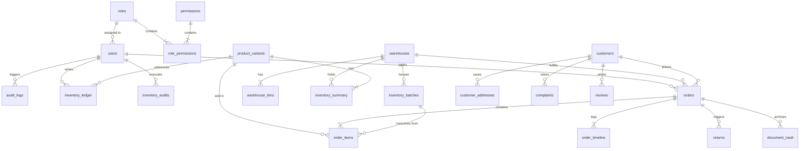

# Merchant OS v1.0 — Architecture Report (Post Phase 1)

This report details the architectural state of Merchant OS v1.0 after the successful completion of the core database and infrastructure phase.

---

## 1. Folder Structure

Below is the current workspace tree showing only the relevant backend files created or modified in Phase 1:

```
House of Singhana/
│
├── index.html                          # Customer Homepage
├── product.html                        # Customer Product detail page
├── checkout.html                       # Customer Cart & checkout page
├── login.html                          # Customer login page
├── index.css                           # Customer styling
├── main.js                             # Customer JS
│
├── merchant-os/                        # ──── Frontend Command OS SPA (Empty Shell) ────
│   └── index.html                      # SPA entry point
│
├── server/                             # ──── Backend Monolithic Server ────
│   ├── database.sqlite                 # SQLite active database
│   ├── package.json                    # Dependencies (added handlebars)
│   ├── server.js                       # Express app entry (refactored to boot Event/Rules engines)
│   ├── db.js                           # Promise-wrapped SQLite connection client (WAL, FK enabled)
│   ├── dbInit.js                       # Schema migration scripts (50+ tables)
│   ├── seed.js                         # Database seeder (Roles, Permissions, Workflows, Templates)
│   │
│   ├── core/                           # ──── Bounded Context Core Frameworks ────
│   │   ├── eventBus.js                 # Event Bus singleton emitting & persisting events
│   │   ├── workflowEngine.js           # JSON-configured State Machine validator & executor
│   │   ├── automationEngine.js         # TCA (Trigger-Condition-Action) rule evaluator
│   │   └── templateEngine.js           # Handlebars layout compiler loading from DB
│   │
│   └── middleware/                     # ──── Security & Policy Guards ────
│       ├── auth.js                     # JWT verification for customers & OS users
│       ├── rbac.js                     # Permission keys evaluator factory
│       ├── audit.js                    # Auto audit logs mutation capture middleware
│       ├── softDelete.js               # SQL filter suffix builder for soft-deleted records
│       └── featureFlag.js              # Module gate checking DB config flags
```

---

## 2. Entity-Relationship (ER) Diagram

The following diagram illustrates the relational layout of the core transactional tables (OLTP) and their auditing associations:



---

## 3. Domain Map (Bounded Contexts)

Merchant OS operates via strictly separated bounded contexts. Database direct writes across boundaries are forbidden:

| Bounded Context | Owning Tables | Primary Service | Primary API Scope |
|---|---|---|---|
| **Authentication** | `users` (super_admin bypasses), `otps` | `authService` | `/api/auth/*` |
| **Users & Roles** | `roles`, `permissions`, `role_permissions` | `authService` | `/api/os/users`, `/api/os/roles` |
| **Products** | `products`, `product_variants`, `categories`, `media_library` | `productService` | `/api/os/products`, `/api/store/products` |
| **Inventory** | `warehouses`, `warehouse_bins`, `inventory_summary`, `inventory_ledger`, `inventory_audits` | `inventoryService` | `/api/os/inventory/*` |
| **Procurement** | `inventory_batches` | `inventoryService` | `/api/os/inventory/batches` |
| **Orders** | `orders`, `order_items`, `order_timeline`, `document_vault` | `orderService` | `/api/os/orders/*`, `/api/orders/*` |
| **Payments** | `payment_reconciliations` | `paymentService` | `/api/os/reconciliation/*` |
| **Support** | `complaints` | `complaintService` | `/api/os/complaints/*` |
| **Reviews** | `reviews` | `reviewService` | `/api/os/reviews/*` |
| **CMS & Config** | `homepage_sections`, `faqs`, `seo_metadata`, `url_redirects`, `document_templates`, `feature_flags` | `storeController` | `/api/os/settings/*`, `/api/store/*` |
| **Analytics** | `analytics_daily_metrics`, `analytics_sku_velocity`, `analytics_customer_cohorts`, `analytics_region_performance`, `daily_closing_reports`, `merchant_timeline` | `analyticsService` | `/api/os/analytics/*` |
| **System** | `domain_events`, `audit_logs`, `system_health_checks`, `scheduled_jobs`, `idempotency_keys`, `archive_rules` | `systemMonitorService`| `/api/os/system/*` |

---

## 4. Event Map

Downstream modules register event callbacks on the singleton `eventBus` to react decoupled from the source trigger:

```
[Domain Event]        -> [Emitted by Service]  -> [Subscriber & Action]
OrderPlaced           -> orderService         -> inventoryService (reserve stock)
                                              -> analyticsService (increment daily count)
                                              -> notificationService (send confirmation)
InvoiceGenerated      -> orderService         -> inventoryService (consume reserved stock)
                                              -> templateEngine (render HTML/PDF Invoice)
                                              -> documentVault (archive PDF)
OrderDispatched       -> orderService         -> notificationService (send WhatsApp with tracking)
                                              -> analyticsService (update average dispatch hours)
BatchReceived         -> inventoryService     -> inventorySummary (recalculate available levels)
                                              -> automationEngine (evaluate Low Stock levels)
StockLow              -> automationEngine     -> notificationService (alert manager dashboard)
ComplaintRaised       -> complaintService     -> notificationService (email support queue)
ReviewSubmitted       -> reviewService        -> notificationService (alert merchant)
PaymentReceived       -> paymentService        -> orderService (advance status to APPROVED)
```

---

## 5. Permission Matrix

The seeded role-permission configuration controls access keys globally:

| Module / Route Prefix | Super Admin | Merchant | Ops Manager | Customer Support | Dispatch / Packing |
|---|---|---|---|---|---|
| `/api/os/users` | **Full** | Denied | Denied | Denied | Denied |
| `/api/os/settings` | **Full** | Denied | Denied | Denied | Denied |
| `/api/os/workflows` | **Full** | Denied | Denied | Denied | Denied |
| `/api/os/products` | **Full** | **Full** | Denied | Denied | Denied |
| `/api/os/orders` | **Full** | **Full** | **Full** | Read-Only | Read-Only / Dispatch |
| `/api/os/inventory` | **Full** | **Full** | **Full** | Denied | Denied |
| `/api/os/complaints` | **Full** | **Full** | Read-Only | **Full** | Denied |
| `/api/os/reviews` | **Full** | **Full** | Denied | **Full** | Denied |
| `/api/os/analytics` | **Full** | **Full** | Denied | Denied | Denied |

---

## 6. Database Statistics

These indicators represent our active relational footprint as checked directly against the SQLite runtime:

*   **Total Tables**: **63** (including sqlite system tables, matching the 50+ domain specs).
*   **Total Indexes**: **39** (on foreign keys, search fields, and unique constraints for indexing performance).
*   **Foreign Key Enforcement**: **Active** (`PRAGMA foreign_keys=ON;` executed on every initialization to protect referential integrity).
*   **Journal Mode**: **WAL** (Write-Ahead Logging enabled for high-concurrency read-write execution).
